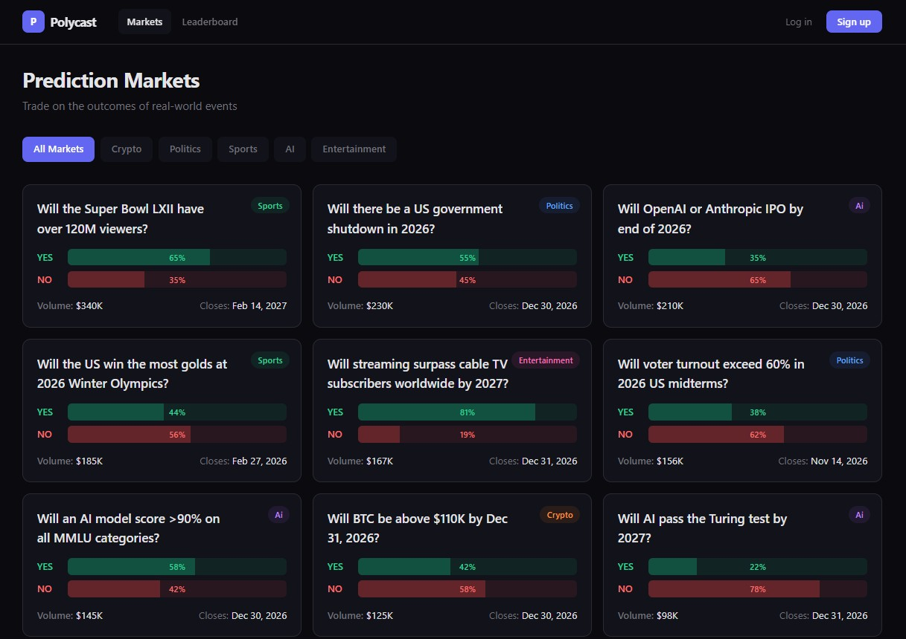
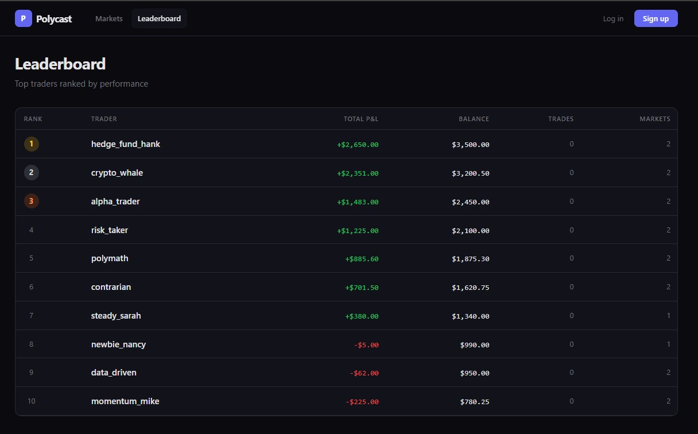

# Polycast — Prediction Market Platform

A full-featured prediction market trading platform where users bet on the outcomes of real-world events using play money. Built with Next.js 14, TypeScript, SQLite, and Tailwind CSS.

Think of it as a simplified Polymarket clone: users buy YES or NO shares on questions like "Will BTC be above $110K by Dec 31?" and earn $1 per share if they're right.





---

## Quick Start

**Prerequisites:** [Node.js 18+](https://nodejs.org/) installed on your machine.

```bash
# 1. Install dependencies
cd polycast
npm install

# 2. Start the development server
npm run dev

# 3. Open in your browser
#    Visit http://localhost:3000
```

That's it. The database is created and seeded automatically on first request. You'll see 15 markets across 5 categories with 10 pre-populated traders on the leaderboard.

**First-time user?** Read the [User Guide](./docs/USER_GUIDE.md) for a step-by-step walkthrough with 12 hands-on use cases.

---

## What Can You Do?

| Action | How |
|--------|-----|
| Browse Markets | Visit the home page, use category tabs to filter |
| View Market Details | Click any market card to see order book, probability, recent trades |
| Sign Up | Click "Sign up" top-right, get $1,000 in play money |
| Place a Trade | Go to market detail, pick YES/NO, set price & quantity, click "Place Order" |
| Track Portfolio | Visit /portfolio to see positions, P&L, and open orders |
| Check Leaderboard | Visit /leaderboard to see ranked traders |

---

## How Trading Works

This is a **binary prediction market** using a **Central Limit Order Book (CLOB)**:

- Every market has two outcomes: **YES** and **NO**
- YES price + NO price always equals **$1.00**
- You buy shares at a price between $0.01 and $0.99
- If your side wins, you get **$1.00 per share**
- If your side loses, you get **$0.00 per share**

**Example:** You buy 100 YES shares at $0.40 (cost: $40). If YES wins, you get $100 (profit: $60). If NO wins, you lose your $40.

Orders match when a YES buyer's price + a NO buyer's price >= $1.00. For example, a YES buy at $0.65 matches with a NO buy at $0.35.

---

## Project Structure

```
polycast/
  src/
    app/              # Pages and API routes (Next.js App Router)
    components/       # Reusable UI components (8 components)
    lib/
      engine/         # CLOB matching engine (the core trading logic)
      db/             # Database schema, connection, seed data
      auth.ts         # Authentication (JWT + bcrypt)
      utils.ts        # Formatting helpers
  tests/
    engine/           # 51 tests — order matching, markets, pricing
    api/              # 32 tests — auth, markets, orders, portfolio, leaderboard
    components/       # 22 tests — MarketCard, TradePanel, OrderBook
  docs/               # Comprehensive documentation
```

---

## Tech Stack

| Technology | What It Does | Analogy for C/Java Developers |
|-----------|-------------|------------------------------|
| **Next.js 14** | React framework with API routes | Like Spring Boot for JavaScript |
| **TypeScript** | Type-safe JavaScript | Like C++ type system for JS |
| **Tailwind CSS** | Utility-first CSS | CSS classes directly on elements |
| **SQLite** (better-sqlite3) | File-based relational database | Like embedded H2 in Java |
| **Vitest** | Test runner | Like JUnit for JavaScript |
| **bcryptjs** | Password hashing | Industry-standard password security |
| **jsonwebtoken** | JWT auth tokens | Stateless authentication via cookies |

---

## Commands Reference

| Command | What It Does |
|---------|-------------|
| `npm install` | Install all dependencies (run once after cloning) |
| `npm run dev` | Start development server on http://localhost:3000 |
| `npm run build` | Create production build |
| `npm start` | Start production server |
| `npm run test:run` | Run all 105 tests once |
| `npm test` | Run tests in watch mode (re-runs on file changes) |
| `npm run lint` | Run ESLint code quality checks |

---

## Seeded Data

The app comes pre-loaded with:

**15 Markets** across 5 categories:
- **Crypto** (3): BTC price, ETH flippening, legal tender adoption
- **Politics** (3): Government shutdown, AI regulation, voter turnout
- **Sports** (3): Super Bowl viewers, sub-2hr marathon, Winter Olympics
- **AI** (3): Turing test, MMLU scores, OpenAI/Anthropic IPO
- **Entertainment** (3): Movie box office, AI-generated films, streaming vs cable

**10 Traders** with pre-populated positions and varying balances ($500-$3,500)

---

## Test Results

```
105 tests passing across 11 test files

  Engine Tests (51):    orderbook matching, market lifecycle, pricing constraints
  API Tests (32):       auth, markets, orders, portfolio, leaderboard
  Component Tests (22): MarketCard, TradePanel, OrderBook rendering
```

Run them: `npm run test:run`

---

## Documentation

| Document | Audience | Description |
|----------|---------|-------------|
| **[Prediction Markets Tutorial](./docs/POLYMARKET_TUTORIAL.md)** | Everyone | Zero-to-hero guide: what prediction markets are, 5 hands-on workflows |
| **[User Guide](./docs/USER_GUIDE.md)** | End Users | Feature walkthrough with 12 hands-on use cases |
| **[Developer Guide](./docs/DEVELOPER_GUIDE.md)** | Developers | Architecture, codebase walkthrough, how to extend |
| **[API Reference](./docs/API_REFERENCE.md)** | Developers | Every endpoint with request/response examples |
| **[Testing Guide](./docs/TESTING_GUIDE.md)** | Developers | How to run, write, and debug tests |
| **[CLAUDE.md](./CLAUDE.md)** | AI Assistants | Project conventions for AI-assisted development |

---

## Architecture Overview

```
Browser (React Components)
    |
    | fetch() HTTP requests
    v
Next.js API Routes (src/app/api/)
    |
    | Function calls
    v
Business Logic (src/lib/engine/)
    |
    | SQL queries (better-sqlite3)
    v
SQLite Database (polycast.db)
```

**Data flow for a trade:**
1. User clicks "Place Order" in TradePanel component
2. Component sends POST to `/api/markets/{id}/orders`
3. API route validates auth, calls `OrderBook.placeOrder()`
4. Engine checks balance, creates order, attempts matching
5. If matched: creates trades, updates positions, updates market price
6. Response returns to browser with order status and trade details

---

## Database Schema (5 Tables)

```
users          markets         orders          trades          positions
-------        --------        ------          ------          ---------
id (PK)        id (PK)         id (PK)         id (PK)         id (PK)
username       title           user_id (FK)    market_id (FK)  user_id (FK)
email          description     market_id (FK)  buyer_order_id  market_id (FK)
password_hash  category        side            seller_order_id side
balance        status          type            price           shares
created_at     yes_price       price           quantity        avg_price
               no_price        quantity        created_at      realized_pnl
               volume          filled_quantity
               resolution_date status
               created_at      created_at
```

---

## Contributing

1. Read the [Developer Guide](./docs/DEVELOPER_GUIDE.md) first
2. Run tests before and after changes: `npm run test:run`
3. Follow existing patterns (see CLAUDE.md for conventions)
4. Keep the test count at 105+ (add tests for new features)

---

## Acknowledgements

- This application was inspired by the YouTube video [Claude Opus 4.6 vs GPT-5.3 Codex](https://www.youtube.com/watch?v=gmSnQPzoYHA&t=884s).
- All code and documentation were generated by [Claude Code](https://claude.ai/claude-code) powered by Opus 4.6.

---

## License

This project is for educational and demonstration purposes.
